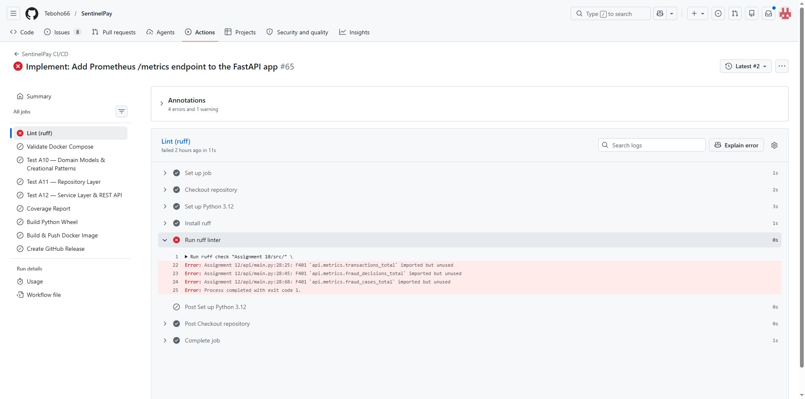
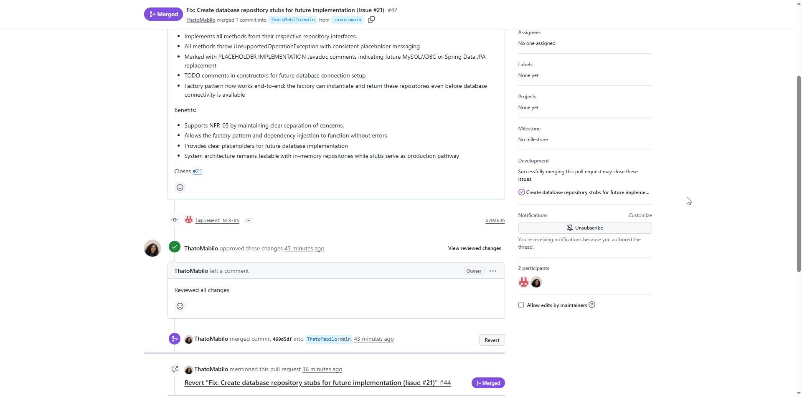
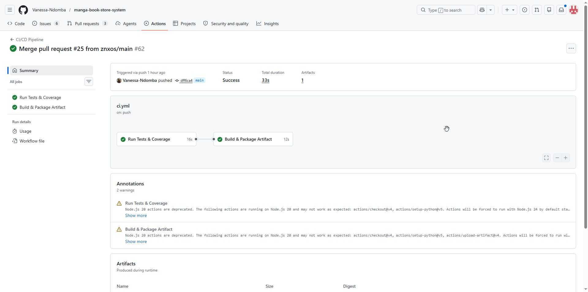

# Merged Pull Requests

Below are the details of the three pull requests submitted and successfully merged into my peers' repositories.

## 1. Implement: Add Prometheus /metrics endpoint to the FastAPI app
*   **Repository:** https://github.com/Teboho66/SentinelPay
*   **PR Link:** https://github.com/Teboho66/SentinelPay/pull/36
*   **Status:** Merged
*   **Summary of Changes:**

Package & Dependencies

Added prometheus-fastapi-instrumentator to requirements.txt
Metrics Module (api/metrics.py)
Three custom counters defined:

sentinelpay_transactions_total — labeled by channel
sentinelpay_fraud_decisions_total — labeled by decision_type
sentinelpay_fraud_cases_total — total cases created
API Integration (api/main.py)

Added Instrumentator() middleware that automatically:
Exposes /metrics endpoint in Prometheus format
Collects HTTP request metrics (latency, status codes, request counts)
Route Handler Instrumentation

handlers/routes/transactions.py — submit_transaction() increments both transactions_total and fraud_decisions_total
handlers/routes/fraud_cases.py — create_fraud_case() increments fraud_cases_total

## 2. Fix: Create database repository stubs for future implementation
*   **Repository:** https://github.com/ThatoMabilo/SmartLibraryManagementSystem
*   **PR Link:** https://github.com/ThatoMabilo/SmartLibraryManagementSystem/pull/42
*   **Status:** Merged
*   **Summary of Changes:**

Features:
Implements all methods from their respective repository interfaces.
All methods throw UnsupportedOperationException with consistent placeholder messaging
Marked with PLACEHOLDER IMPLEMENTATION Javadoc comments indicating future MySQL/JDBC or Spring Data JPA replacement
TODO comments in constructors for future database connection setup
Factory pattern now works end-to-end: the factory can instantiate and return these repositories even before database connectivity is available

Benefits:
Supports NFR-05 by maintaining clear separation of concerns.
Allows the factory pattern and dependency injection to function without errors
Provides clear placeholders for future database implementation
System architecture remains testable with in-memory repositories while stubs serve as production pathway

## 3. 
*   **Repository:** https://github.com/Vanessa-Ndomba/manga-book-store-system
*   **PR Link:** https://github.com/Vanessa-Ndomba/manga-book-store-system/pull/25
*   **Status:** Merged
*   **Summary of Changes:
Added tests in tests/api/ using FastAPI TestClient
Cover flow: create user → create manga → create order → checkout

Acceptance Criteria:
pytest -q tests/api passes

Name Stmts Miss Cover Missing
tests\api\test_api_workflow.py 134 0 100%

