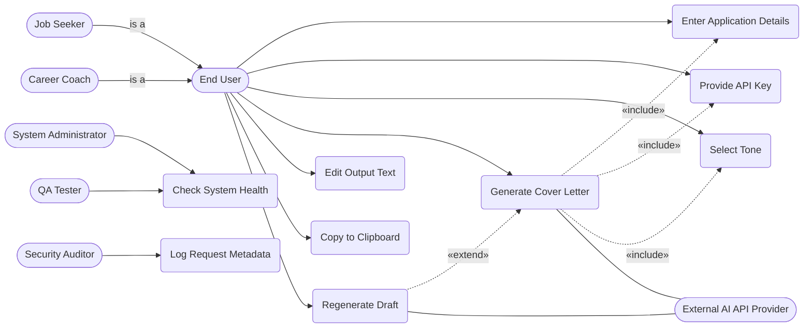

# Test and Use Case Document

## 1. Use Case Diagram

### 1.1 Mermaid Diagram

### 1.2 Written Explanation

**Key Actors and Their Roles:**
1. **End User (Generalised Actor):** Represents any human interacting with the frontend interface to input data and receive output. 
2. **Job Seeker:** A specialised End User who is the primary target audience. They input their own resume and target job descriptions.
3. **Career Coach:** A specialised End User who uses the system on behalf of or alongside a client, often selecting specific tones or editing outputs for professional polish.
4. **External AI API Provider:** A system actor responsible for receiving compiled prompts and returning generated text.
5. **System Administrator:** An operational actor responsible for managing the deployed environment and environment variables.
6. **QA Tester:** Evaluates the system's compliance with NFRs and FRs, frequently interacting with diagnostic endpoints like the health check.
7. **Security Auditor:** Reviews the system's compliance with NFR-09, ensuring sensitive data (API keys) remains unlogged.

**Relationships Between Actors and Use Cases:**
*   **Generalisation:** *Job Seeker* and *Career Coach* generalise into *End User*. Both inherit the ability to interface with the core text-generation use cases, simplifying the diagram and logic.
*   **Inclusion (`<<include>>`):** The *Generate Cover Letter* use case **includes** *Provide API Key*, *Enter Application Details*, and *Select Tone*. Generation is impossible unless the user executes these foundational steps first (FR-01, FR-02, FR-03).
*   **Extension (`<<extend>>`):** *Regenerate Draft* **extends** *Generate Cover Letter*. It acts as an optional alternative flow initiated by the user if they are unsatisfied with the initial output, leveraging existing state data (FR-06).

**Addressing Stakeholder Concerns:**
This diagram addresses the *Job Seeker's* need for speed and ease of iteration by giving them direct access to *Generate*, *Regenerate*, and *Edit* functionalities. It resolves the *QA Tester's* and *Developer's* need for testable infrastructure by explicitly decoupling the *Check System Health* and *Log Request Metadata* functionalities into dedicated interactions for operational roles. Furthermore, separating the *External AI API Provider* clearly delineates system boundaries, isolating the risk of API misuse (a key concern for external providers).

### UC-09: Log Request Metadata
*   **Actor:** Security Auditor, System Administrator
*   **Description:** The system automatically logs non-sensitive request metadata for diagnostics and auditing purposes.
*   **Preconditions:** The backend application receives a generation request.
*   **Postconditions:** A log entry is created containing timestamp, status, latency, and error type, explicitly excluding user text and API keys.
*   **Basic Flow:**
    1. User submits a generation request.
    2. System processes the request.
    3. System writes a log entry with the request metadata (FR-10).
    4. Security Auditor or System Administrator reviews the logs via the server console or log management system to verify compliance (NFR-09).
*   **Alternative Flows:**
    *   *Log Write Failure:* System gracefully continues processing the user request even if the logging operation fails temporarily.

---

## 2. Use Case Specifications

### UC-01: Generate Cover Letter
*   **Actor:** End User (Job Seeker / Career Coach), External AI API Provider
*   **Description:** The primary process where user inputs are combined to produce an AI-generated tailored cover letter.
*   **Preconditions:** System is online. User has entered valid text into the resume and job description fields. User has entered a valid API Key.
*   **Postconditions:** A tailored cover letter is displayed in the output area. Usage logs (without sensitive data) are recorded.
*   **Basic Flow:**
    1. User clicks the "Generate" button.
    2. System validates that application details and API key are present.
    3. System compiles the prompt with the selected tone, resume, and job description.
    4. System sends the payload to the External AI API Provider.
    5. External API returns the generated text and template version metadata.
    6. System displays the text in the output area.
*   **Alternative Flows:** 
    *   *API Key Missing:* System blocks generation and prompts "API Key is required" (FR-03).
    *   *Upstream Timeout:* System catches the timeout from the AI provider and displays a clear error message (FR-09).

### UC-02: Enter Application Details
*   **Actor:** End User
*   **Description:** User provides the base materials (Job Description and Resume) required for generation.
*   **Preconditions:** User has navigated to the main application page.
*   **Postconditions:** The text areas contain valid strings ready for the generation payload.
*   **Basic Flow:**
    1. User pastes Job Description text into the designated field.
    2. System validates input allows up to 3000 characters and preserves line breaks.
    3. User pastes Resume text into the designated field.
    4. System validates input allows up to 6000 characters.
*   **Alternative Flows:**
    *   *Input Exceeds Limit:* System prevents further typing and displays a visual truncation warning limit.

### UC-03: Provide API Key
*   **Actor:** End User
*   **Description:** User enters their private AI platform API key to authenticate subsequent upstream requests.
*   **Preconditions:** None.
*   **Postconditions:** API key is held securely in the active session state but NOT persisted.
*   **Basic Flow:**
    1. User pastes the API key into the secure password-masked input field.
    2. System stores the key in the current application state memory.
*   **Alternative Flows:**
    *   *Key Contains Whitespace:* System automatically trims trailing/leading whitespaces upon input.

### UC-04: Select Tone
*   **Actor:** End User
*   **Description:** User selects the desired professional voice for the generated document.
*   **Preconditions:** None.
*   **Postconditions:** The chosen tone parameter is updated in the session state.
*   **Basic Flow:**
    1. User clicks the "Tone" dropdown menu.
    2. User selects a tone (e.g., "Confident", "Concise", "Formal").
    3. System highlights the active selection.
*   **Alternative Flows:** None. System defaults to "Formal" if unselected.

### UC-05: Regenerate Draft
*   **Actor:** End User, External AI API Provider
*   **Description:** User requests a new variation of the cover letter using previously entered inputs.
*   **Preconditions:** A cover letter has already been generated. Inputs and API key remain populated.
*   **Postconditions:** The old cover letter is replaced by a newly generated variant.
*   **Basic Flow:**
    1. User clicks "Regenerate".
    2. System re-sends the payload to the AI provider without clearing the form fields.
    3. AI provider returns a new text response.
    4. System overwrites the output area with the new draft.
*   **Alternative Flows:** 
    *   *API Key Revoked:* If the key expired between generations, system displays an authorization error.

### UC-06: Edit Output Text
*   **Actor:** End User
*   **Description:** User manually fine-tunes the generated cover letter before final usage.
*   **Preconditions:** A cover letter exists in the output area.
*   **Postconditions:** The modified text is saved in the active output area state.
*   **Basic Flow:**
    1. User clicks into the generated text area.
    2. User types, deletes, or modifies content.
    3. System retains these edits until the user clears the form or regenerates.
*   **Alternative Flows:** None.

### UC-07: Copy to Clipboard
*   **Actor:** End User
*   **Description:** User copies the final text to their system clipboard for external use.
*   **Preconditions:** Text exists in the output area.
*   **Postconditions:** User's operating system clipboard contains the text.
*   **Basic Flow:**
    1. User clicks "Copy to Clipboard" button.
    2. System transfers the full text of the output area to the OS clipboard.
    3. System flashes a visual "Copied!" success indicator within 1 second (FR-08).
*   **Alternative Flows:**
    *   *Browser Clipboard Denied:* System shows an error prompting the user to select and copy the text manually.

### UC-08: Check System Health
*   **Actor:** QA Tester, System Administrator
*   **Description:** Operational verification that the backend service is running and responsive.
*   **Preconditions:** The backend application is deployed.
*   **Postconditions:** System status remains unchanged; status metadata is returned.
*   **Basic Flow:**
    1. Actor navigates to or pings the `/health` endpoint via HTTP GET.
    2. System processes the request without evaluating AI dependencies.
    3. System returns an HTTP 200 response with a JSON payload indicating healthy status.
*   **Alternative Flows:**
    *   *System Unreachable:* Request times out or returns a 50x error code indicating backend failure.

---

## 3. Test Cases

### 3.1 Functional Test Cases

| Test Case ID | Requirement ID | Description | Steps | Expected Result | Actual Result | Status (Pass/Fail) |
|---|---|---|---|---|---|---|
| TC-001 | FR-01 | Validate Job Description input limit | 1. Paste 3500 chars of text into Job Desc field. 2. Observe UI. | Field accepts up to 3000 chars and preserves formatting. | ... | ... |
| TC-002 | FR-02 | Validate Resume input limit | 1. Paste 6000 chars of text into Resume field. | Text is accepted entirely without truncation. | ... | ... |
| TC-003 | FR-03 | API key validation block | 1. Leave API Key field blank. 2. Enter valid texts. 3. Click Generate. | Generate action is blocked. Error message displayed. | ... | ... |
| TC-004 | FR-04 | Successful text generation | 1. Enter valid Resume, Job Desc, and API Key. 2. Click Generate. | A complete cover letter with greeting and closing appears. | ... | ... |
| TC-005 | FR-05 | Tone selection verification | 1. Select "Concise" tone. 2. Click Generate. 3. Check network payload. | The payload sent to the backend includes `tone: "Concise"`. | ... | ... |
| TC-006 | FR-06 | Regenerate retains input | 1. Generate text. 2. Click Regenerate. 3. Check input fields. | New text appears; Job Desc and Resume fields remain filled. | ... | ... |
| TC-007 | FR-08 | Copy to clipboard action | 1. Generate text. 2. Click "Copy". 3. Paste into local notepad. | Text matches perfectly. "Success" feedback shown <1s. | ... | ... |
| TC-008 | FR-11 | Validate health endpoint | 1. Send HTTP GET to `/health`. | Status 200 OK returned with JSON indicating health. | ... | ... |

### 3.2 Non-Functional Test Scenarios

| Test Case ID | Requirement ID | Description | Steps | Expected Result | Actual Result | Status (Pass/Fail) |
|---|---|---|---|---|---|---|
| NFR-TC-001 | NFR-07 (Scalability) | High concurrency stress test | 1. Set backend to mock/test mode. 2. Use JMeter to send 100 concurrent POST requests. | API handles all 100 requests, returning 200 OK without crashing or memory leaks. | ... | ... |
| NFR-TC-002 | NFR-09 (Security) | API Key absence in logs | 1. Submit a valid generation request. 2. Security Auditor inspects the server application logs. | Logs show timestamp, status, latency. API key string is completely absent from all log files. | ... | ... |

---

## 4. Reflection

**Challenges in Translating Requirements to Use Cases and Tests**

There were a few major difficulties in converting the system requirements document (SRD) for TailorFit into tangible use cases and test cases, with the main reason being the nature of a very lightweight AI-based application. The first big problem was the handling of the non-deterministic behaviour of the External AI API (Language Model). Use cases and functional test cases typically depend on deterministic, highly predictable inputs and outputs. For example, testing a normal calculation will give you the same output every time. However, FR-04 expects the system to create a customized cover letter. It is quite challenging to formulate a definite Pass/Fail test case for this requirement since every API call, even with the same input, produces a different output string.

As a result, in order to turn this into a testable scenario, I had to change the emphasis from verifying the exact text content to checking for the structural presence of the required elements (such as the greeting, introductory paragraph, and closing) and making sure the system properly communicates the metadata like the chosen tone (FR-05) in the underlying request payload.

There was also a big issue with figuring out the minimum number of actors required (six) for a system that is only a "single-page frontend without user authentication." It seemed at first that there was just one human user (Job Seeker) and one system actor (External AI API). To meet the complexity requirements of the assignment without breaking the project's scope constraints, I had to go for a very thorough review of the stakeholders list of the previous assignment (Assignment 4).I realized that the "End User" actor can be used as a UML Generalisation (without the authentication layer) and, from it, "Job Seeker" and "Career Coach" inherit.

The final main actors were "System Administrator", "Security Auditor", and "QA Tester", which is a quite innovative notion for a deployability and security context (NFR-03, NFR-09).In fact, these correspond closely to a real-life software lifecycle in which QA and Ops directly interact with health endpoints (FR-11) and log outputs (FR-10).

It was tough to organise test cases with security and operational non-functional requirements (NFRs). It was necessary for NFR-09 to cleverly map a "negative requirement" (something the system must *not* do) into a positive, verifiable action. The test case written in the end had to give the Security Auditor detailed instructions on how to carry out the generation and subsequently go over the backend log files to check the total absence of the sensitive string.

The last thing was the careful work needed to model the relationships between use cases with the proper differentiation of `<<include>>` and `<<extend>>`. Since the making or re-making of a letter is totally dependent on the provision of the API Key (FR-03), I chose to use `<<include>>` for "Provide API Key". On the other hand, "Regenerate Draft" was handled by `<<extend>>` because it is an optional variation of the main "Generate Cover Letter" workflow.
