# Assignment 8: Object State & Activity Workflow Modeling

## 1. Object State Modeling (State Transition Diagrams)

### 1.1 Object: Application Session
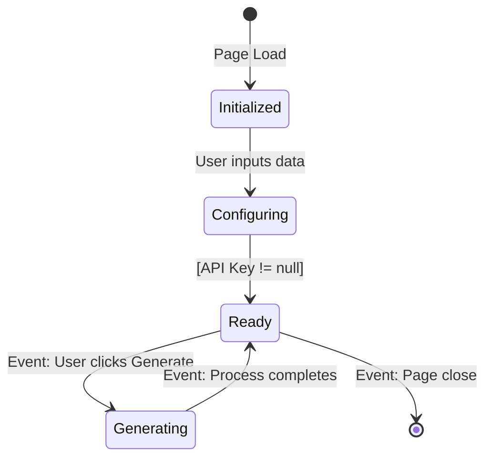
```mermaid
stateDiagram-v2
    [*] --> Initialized: Page Load
    Initialized --> Configuring: User inputs data
    Configuring --> Ready: [API Key != null]
    Ready --> Generating: Event: User clicks Generate
    Generating --> Ready: Event: Process completes
    Ready --> [*]: Event: Page close
```
**Explanation:**
*   Key states & transitions: The session starts `Initialized`, moves to `Configuring` as the user types, and reaches `Ready` only when guarded by the condition `[API Key != null]`. During API calls, it enters `Generating` to lock the UI, returning to `Ready` once complete.
*   Mapping to FRs: Addresses FR-03 (API Key requirement blocks generation) and NFR-01 (Single-page workflow state).

### 1.2 Object: API Key Credential
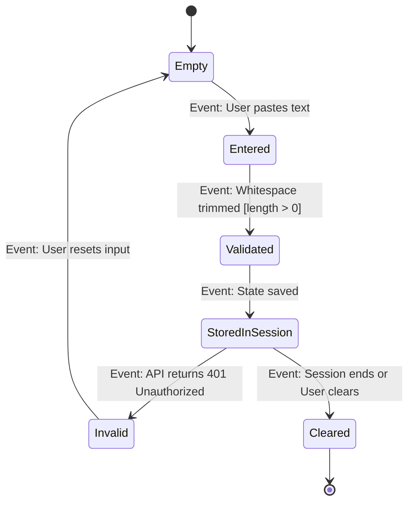
```mermaid
stateDiagram-v2
    [*] --> Empty
    Empty --> Entered: Event: User pastes text
    Entered --> Validated: Event: Whitespace trimmed [length > 0]
    Validated --> StoredInSession: Event: State saved
    StoredInSession --> Invalid: Event: API returns 401 Unauthorized
    StoredInSession --> Cleared: Event: Session ends or User clears
    Invalid --> Empty: Event: User resets input
    Cleared --> [*]
```
**Explanation:**
*   Key states & transitions: Transitions from `Empty` to `StoredInSession` after validation. If the upstream API rejects it, it enters an `Invalid` state, requiring user intervention.
*   Mapping to FRs: Directly addresses FR-03 (Provide API Key) and NFR-09 (Security: Key goes to `Cleared` on session end, never persisted to logs or storage).

### 1.3 Object: Job Description Input
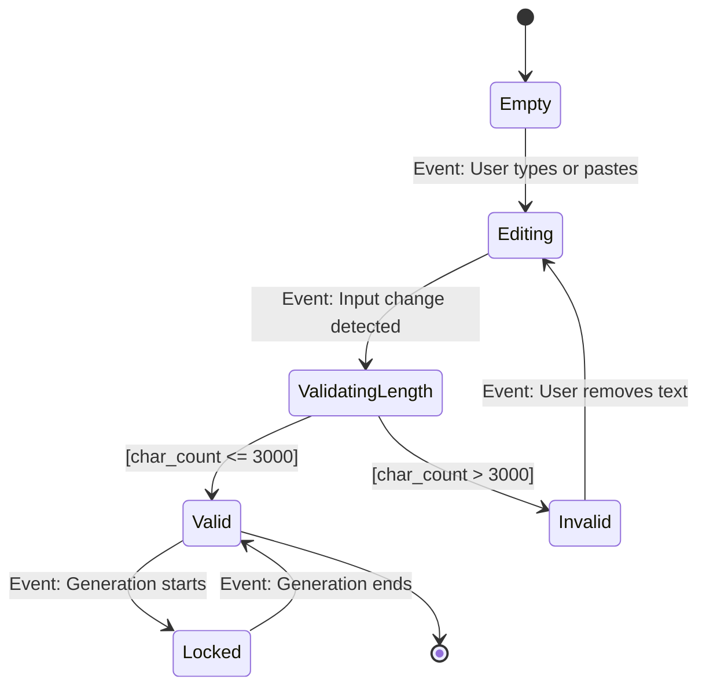
```mermaid
stateDiagram-v2
    [*] --> Empty
    Empty --> Editing: Event: User types or pastes
    Editing --> ValidatingLength: Event: Input change detected
    ValidatingLength --> Valid: [char_count <= 3000]
    ValidatingLength --> Invalid: [char_count > 3000]
    Invalid --> Editing: Event: User removes text
    Valid --> Locked: Event: Generation starts
    Locked --> Valid: Event: Generation ends
    Valid --> [*]
```
**Explanation:**
*   Key states & transitions: Guard conditions dictate if the input is `Valid` or `Invalid` based on strict character limits. Inputs are temporarily `Locked` during generation to prevent mid-flight changes.
*   Mapping to FRs: Addresses FR-01 (Job Description text input limit of 3000 characters).

### 1.4 Object: Resume Input

```mermaid
stateDiagram-v2
    [*] --> Empty
    Empty --> Editing: Event: User types or pastes
    Editing --> ValidatingLength: Event: Input change detected
    ValidatingLength --> Valid: [char_count <= 6000]
    ValidatingLength --> Invalid: [char_count > 6000]
    Invalid --> Editing: Event: User removes text
    Valid --> Locked: Event: Generation starts
    Locked --> Valid: Event: Generation ends
    Valid --> [*]
```
**Explanation:**
*   Key states & transitions: Mirrors the Job Description behavior but applies a different guard condition `[char_count <= 6000]`.
*   Mapping to FRs: Addresses FR-02 (Resume text input limit of 6000 characters).

### 1.5 Object: Cover Letter Draft
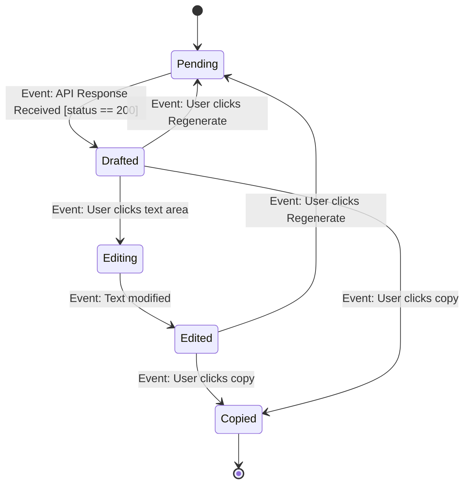
```mermaid
stateDiagram-v2
    [*] --> Pending
    Pending --> Drafted: Event: API Response Received [status == 200]
    Drafted --> Editing: Event: User clicks text area
    Editing --> Edited: Event: Text modified
    Edited --> Copied: Event: User clicks copy
    Drafted --> Copied: Event: User clicks copy
    Copied --> [*]
    Drafted --> Pending: Event: User clicks Regenerate
    Edited --> Pending: Event: User clicks Regenerate
```
**Explanation:**
*   Key states & transitions: Tracks the lifecycle of the generated text payload. It allows an `Editing` state that moves to `Edited`, or can be entirely wiped by looping back to `Pending` via a "Regenerate" event.
*   Mapping to FRs: Maps to FR-04 (Generate draft), FR-06 (Regenerate draft), and FR-07 (Manually edit text).

### 1.6 Object: Generation Request (Backend)
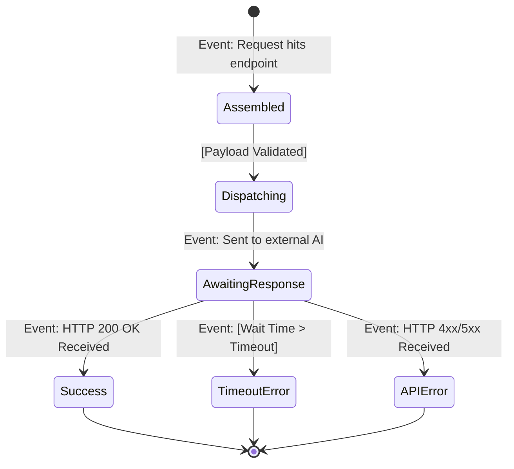
```mermaid
stateDiagram-v2
    [*] --> Assembled: Event: Request hits endpoint
    Assembled --> Dispatching: [Payload Validated]
    Dispatching --> AwaitingResponse: Event: Sent to external AI
    AwaitingResponse --> Success: Event: HTTP 200 OK Received
    AwaitingResponse --> TimeoutError: Event: [Wait Time > Timeout]
    AwaitingResponse --> APIError: Event: HTTP 4xx/5xx Received
    Success --> [*]
    TimeoutError --> [*]
    APIError --> [*]
```
**Explanation:**
*   Key states & transitions: Captures the backend connection lifecycle. Guard conditions check internal payload validity, while external events like `[Wait Time > Timeout]` trigger specific error states.
*   Mapping to FRs: Maps to FR-09 (Clear error messages for timeouts/API errors) and NFR-08 (Timeout configurability).

### 1.7 Object: Request Metadata Log
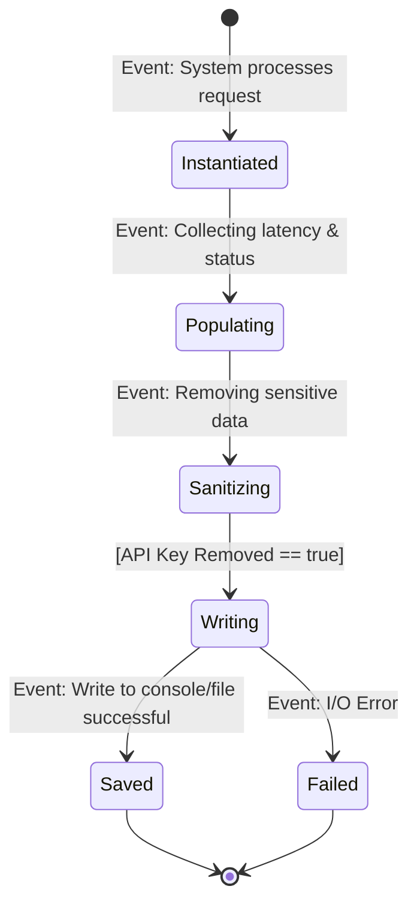
```mermaid
stateDiagram-v2
    [*] --> Instantiated: Event: System processes request
    Instantiated --> Populating: Event: Collecting latency & status
    Populating --> Sanitizing: Event: Removing sensitive data
    Sanitizing --> Writing: [API Key Removed == true]
    Writing --> Saved: Event: Write to console/file successful
    Writing --> Failed: Event: I/O Error
    Saved --> [*]
    Failed --> [*]
```
**Explanation:**
*   Key states & transitions: A critical security flow ensuring the `Sanitizing` state occurs completely before `Writing`, guarded strictly by a condition verifying keys are stripped.
*   Mapping to FRs: Maps to FR-10 (Record metadata) and NFR-09 (Security: No API key in logs).

### 1.8 Object: Health Check Payload
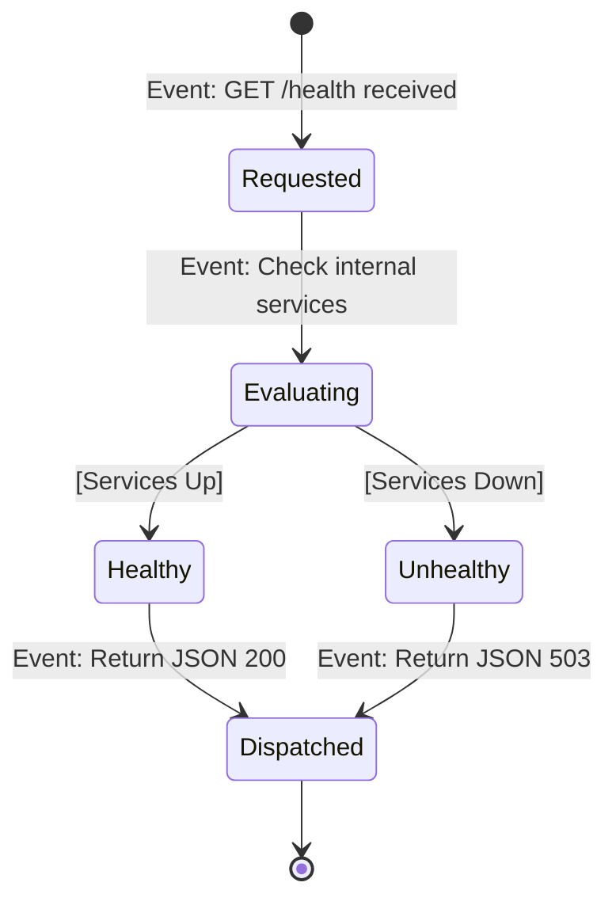
```mermaid
stateDiagram-v2
    [*] --> Requested: Event: GET /health received
    Requested --> Evaluating: Event: Check internal services
    Evaluating --> Healthy: [Services Up]
    Evaluating --> Unhealthy: [Services Down]
    Healthy --> Dispatched: Event: Return JSON 200
    Unhealthy --> Dispatched: Event: Return JSON 503
    Dispatched --> [*]
```
**Explanation:**
*   Key states & transitions: A straightforward operational object responding to system ping requests, transitioning based on internal uptime guard conditions.
*   Mapping to FRs: Maps to FR-11 (Health check endpoint) and US-011.

---

## 2. Activity Workflow Modeling (Activity Diagrams)

### 2.1 WF-01: Input Application Details Workflow
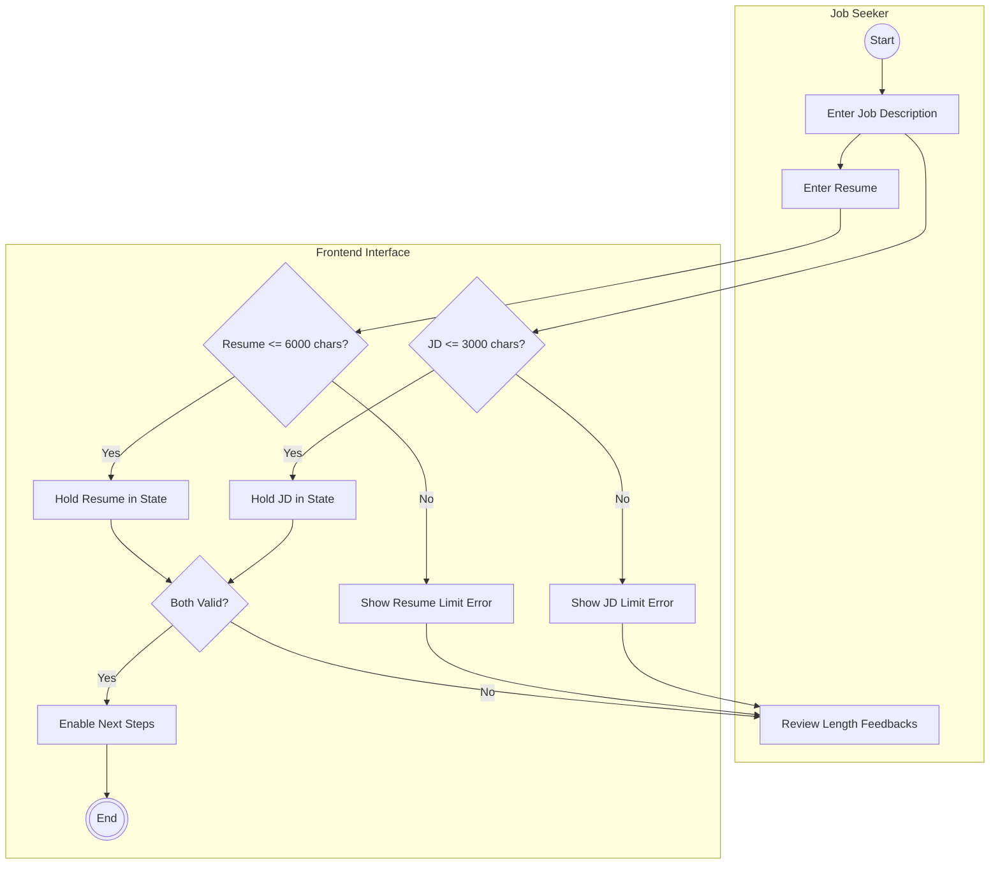
```mermaid
flowchart TD
    subgraph JobSeeker [Job Seeker]
        Start((Start)) --> EnterJD[Enter Job Description]
        EnterJD --> EnterRes[Enter Resume]
        ReviewLimits[Review Length Feedbacks]
    end
    subgraph Frontend [Frontend Interface]
        EnterJD --> ValJD{JD <= 3000 chars?}
        EnterRes --> ValRes{Resume <= 6000 chars?}
        
        ValJD -- No --> ShowJDErr[Show JD Limit Error]
        ValJD -- Yes --> StoreJD[Hold JD in State]
        
        ValRes -- No --> ShowResErr[Show Resume Limit Error]
        ValRes -- Yes --> StoreRes[Hold Resume in State]
        
        ShowJDErr --> ReviewLimits
        ShowResErr --> ReviewLimits
        StoreJD --> CheckAll{Both Valid?}
        StoreRes --> CheckAll
        
        CheckAll -- Yes --> ReadyGen[Enable Next Steps]
        CheckAll -- No --> ReviewLimits
        
        ReadyGen --> End(((End)))
    end
```
*   Stakeholder Concerns Addressed: Ensures the Job Seeker (SH-01) receives immediate, client-side feedback without waiting for backend calls, saving time and preventing frustration over arbitrary limits.

### 2.2 WF-02: Authenticate Generation Request Workflow
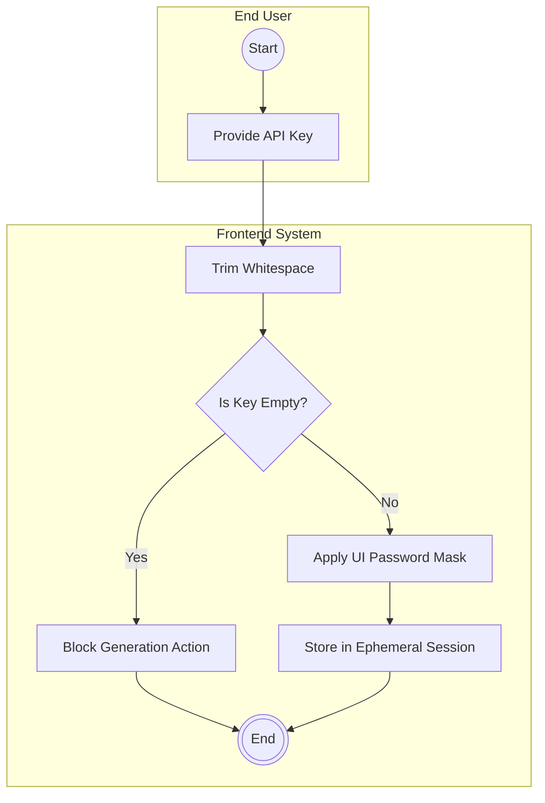
```mermaid
flowchart TD
    subgraph EndUser [End User]
        Start((Start)) --> PasteKey[Provide API Key]
    end
    subgraph Frontend [Frontend System]
        PasteKey --> Trim[Trim Whitespace]
        Trim --> ValKey{Is Key Empty?}
        ValKey -- Yes --> Block[Block Generation Action]
        ValKey -- No --> Mask[Apply UI Password Mask]
        Mask --> Memory[Store in Ephemeral Session]
        
        Block --> End(((End)))
        Memory --> End
    end
```
*   Stakeholder Concerns Addressed: Directly addresses the Security Auditor / External AI Provider (SH-06) requirement to sanitize inputs and securely hold credentials only in ephemeral memory rather than persistent storage (NFR-09).

### 2.3 WF-03: Generate Cover Letter Workflow
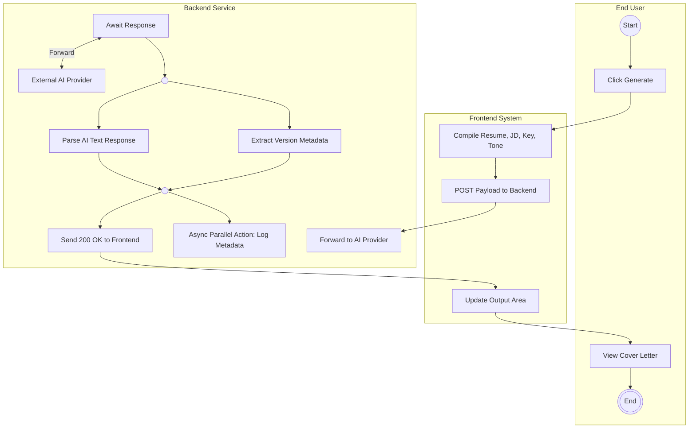
```mermaid
flowchart TD
    subgraph User [End User]
        Start((Start)) --> ClickGen[Click Generate]
        ViewRes[View Cover Letter] --> End(((End)))
    end
    subgraph Frontend [Frontend System]
        ClickGen --> BuildPayload[Compile Resume, JD, Key, Tone]
        BuildPayload --> SendReq[POST Payload to Backend]
        RenderUI[Update Output Area] --> ViewRes
    end
    subgraph Backend [Backend Service]
        SendReq --> Forward[Forward to AI Provider]
        Wait[Await Response] <-- Forward --> AI[External AI Provider]
        Wait --> SplitFork(( ))
        
        SplitFork --> Parse[Parse AI Text Response]
        SplitFork --> Meta[Extract Version Metadata]
        
        Parse --> JoinSync(( ))
        Meta --> JoinSync
        
        JoinSync --> Return[Send 200 OK to Frontend]
        Return --> RenderUI
        
        JoinSync --> ParallelLog[Async Parallel Action: Log Metadata]
    end
```
*   Stakeholder Concerns Addressed: The parallel action for logging request metadata ensures the Job Seeker (SH-01) gets their UI updated instantly without waiting for disk I/O operations, meeting the Developer's (SH-04) system performance and tracking needs simultaneously.

### 2.4 WF-04: Apply Professional Tone Workflow
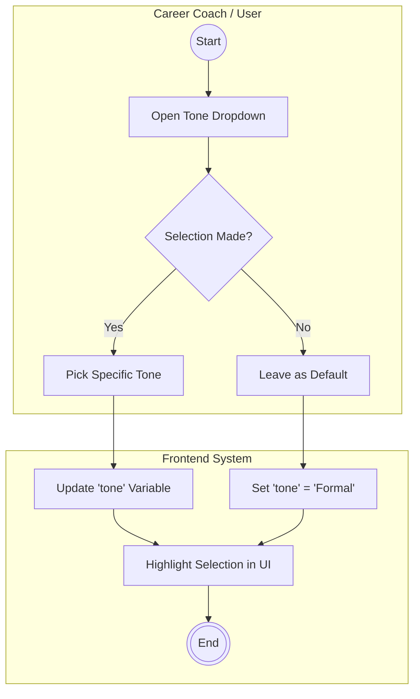
```mermaid
flowchart TD
    subgraph Coach [Career Coach / User]
        Start((Start)) --> OpenDrop[Open Tone Dropdown]
        OpenDrop --> SelectTone{Selection Made?}
        SelectTone -- Yes --> Pick[Pick Specific Tone]
        SelectTone -- No --> Default[Leave as Default]
    end
    subgraph System [Frontend System]
        Pick --> UpdateState[Update 'tone' Variable]
        Default --> SetFormal[Set 'tone' = 'Formal']
        
        UpdateState --> Highlight[Highlight Selection in UI]
        SetFormal --> Highlight
        
        Highlight --> End(((End)))
    end
```
*   Stakeholder Concerns Addressed: Allows the Career Coach (SH-02) to control stylistic output natively, addressing their specific pain point of having to heavily rewrite overly casual or inappropriate AI drafts.

### 2.5 WF-05: Regenerate Draft Workflow
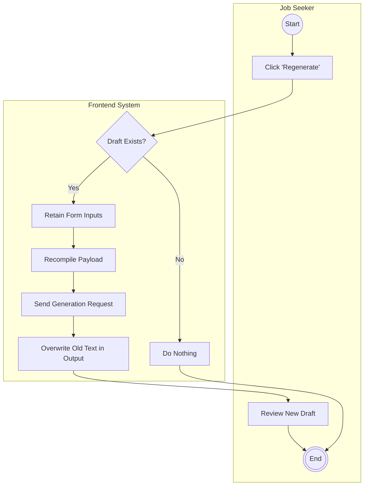
```mermaid
flowchart TD
    subgraph User [Job Seeker]
        Start((Start)) --> ClickRegen[Click 'Regenerate']
        ReviewNew[Review New Draft] --> End(((End)))
    end
    subgraph Frontend [Frontend System]
        ClickRegen --> CheckState{Draft Exists?}
        CheckState -- No --> Ignore[Do Nothing]
        CheckState -- Yes --> KeepForm[Retain Form Inputs]
        KeepForm --> Rebuild[Recompile Payload]
        Rebuild --> Send[Send Generation Request]
        Send --> ReplaceUI[Overwrite Old Text in Output]
        ReplaceUI --> ReviewNew
        Ignore --> End
    end
```
*   Stakeholder Concerns Addressed: Meets the Job Seeker (SH-01) need for rapid, low-friction iteration. By branching logic to confirm existing state, it prevents unnecessary typing and maximizes the utility of the AI tool.

### 2.6 WF-06: Manual Refinement (Edit) Workflow
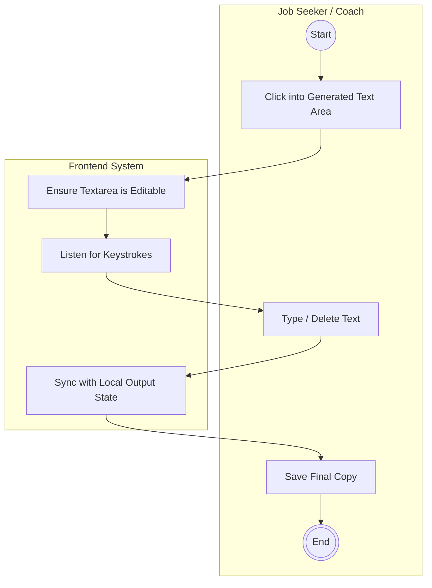
```mermaid
flowchart TD
    subgraph User [Job Seeker / Coach]
        Start((Start)) --> ClickArea[Click into Generated Text Area]
        Modify[Type / Delete Text]
        SaveDraft[Save Final Copy] --> End(((End)))
    end
    subgraph Frontend [Frontend System]
        ClickArea --> UnlockUI[Ensure Textarea is Editable]
        UnlockUI --> Listen[Listen for Keystrokes]
        Listen --> Modify
        Modify --> SyncState[Sync with Local Output State]
        SyncState --> SaveDraft
    end
```
*   Stakeholder Concerns Addressed: Empowers both the Job Seeker (SH-01) and Recruiter (SH-03) by ensuring the output can be tailored authentically, directly fighting against generic language.

### 2.7 WF-07: Copy to Clipboard Workflow
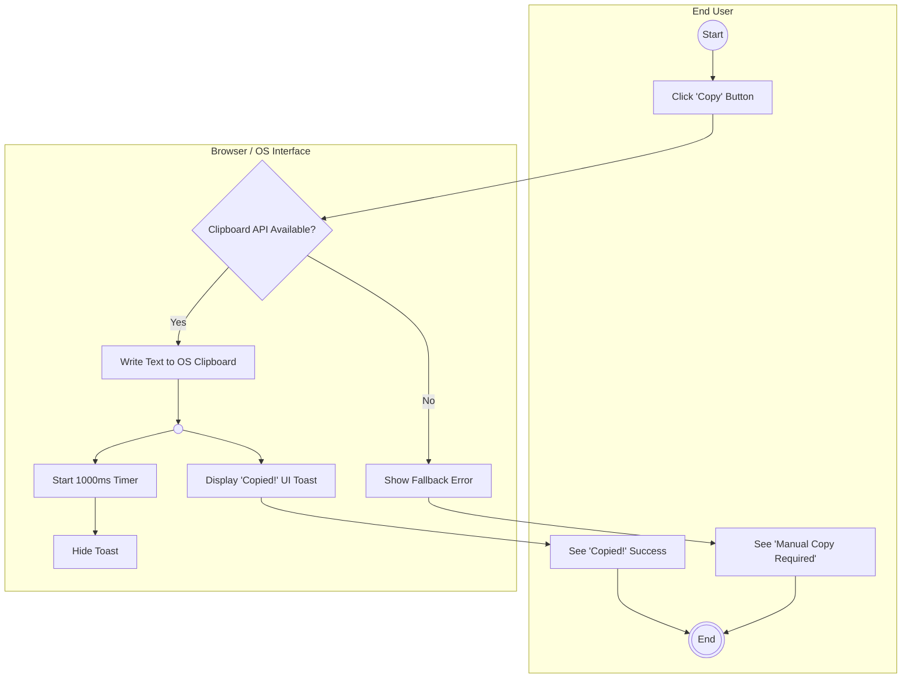
```mermaid
flowchart TD
    subgraph User [End User]
        Start((Start)) --> ClickCopy[Click 'Copy' Button]
        SeeToast[See 'Copied!' Success] --> End(((End)))
        SeeErr[See 'Manual Copy Required'] --> End
    end
    subgraph Browser [Browser / OS Interface]
        ClickCopy --> CheckPerm{Clipboard API Available?}
        
        CheckPerm -- Yes --> ExecCopy[Write Text to OS Clipboard]
        ExecCopy --> SplitFork(( ))
        
        SplitFork --> Toast[Display 'Copied!' UI Toast]
        SplitFork --> Timer[Start 1000ms Timer]
        
        Timer --> Hide[Hide Toast]
        Toast --> SeeToast
        
        CheckPerm -- No --> Fallback[Show Fallback Error]
        Fallback --> SeeErr
    end
```
*   Stakeholder Concerns Addressed: Uses parallel UI threads (the timer logic and visual toast rendering) to give the Job Seeker (SH-01) immediate positive feedback (FR-08), enhancing the perceived application speed and usability.

### 2.8 WF-08: Execute Health Diagnostic Workflow
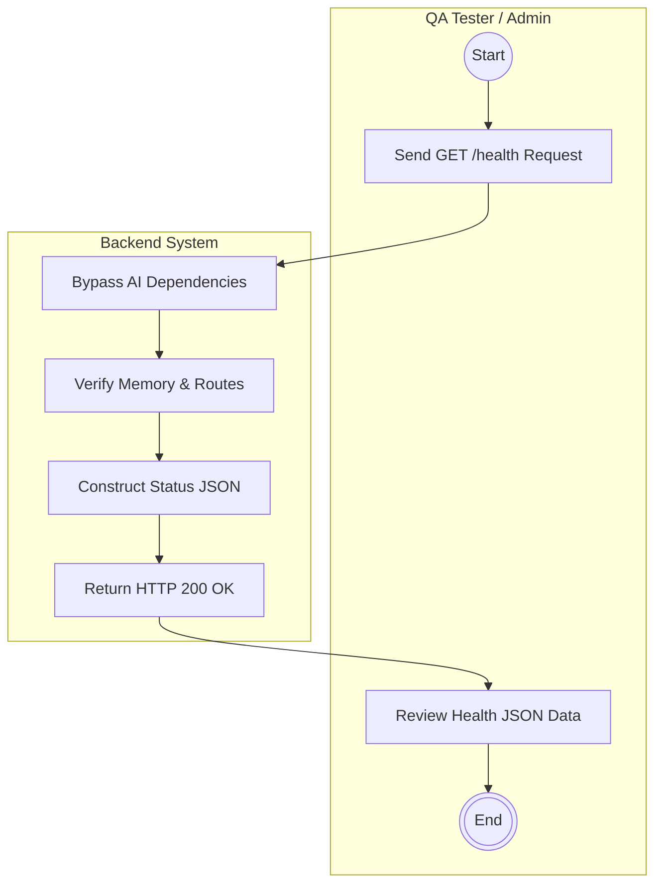
```mermaid
flowchart TD
    subgraph QATester [QA Tester / Admin]
        Start((Start)) --> Ping[Send GET /health Request]
        ReadRes[Review Health JSON Data] --> End(((End)))
    end
    subgraph Backend [Backend System]
        Ping --> BypassAI[Bypass AI Dependencies]
        BypassAI --> CheckMem[Verify Memory & Routes]
        CheckMem --> ConstructRes[Construct Status JSON]
        ConstructRes --> Return200[Return HTTP 200 OK]
        Return200 --> ReadRes
    end
```
*   Stakeholder Concerns Addressed: Provides a strictly decoupled operational check for the System Admin / QA Tester (SH-05), ensuring deployment integrity independently without risking quota breaches on external AI provider (SH-06) credits.

---

## 3. Integration with Prior Work (Traceability)

| Diagram Model | Related Functional Requirement | Agile User Story / Sprint Task |
| :--- | :--- | :--- |
| Object: Application Session | NFR-01 (Single Page), FR-03 (API Key) | US-003, T-003, T-004 |
| Object: Job Desc Input | FR-01 (Input limits) | US-001, T-001 |
| Object: Resume Input | FR-02 (Input limits) | US-002, T-002 |
| Object: Cover Letter Draft | FR-04, FR-06, FR-07 | US-004, US-006, US-007, T-008 |
| Object: Request Metadata Log| FR-10, NFR-09 (Security logs) | US-010 |
| WF-02: Authenticate Request | FR-03 (API key check) | US-003, T-004 |
| WF-03: Generate Workflow | FR-04, FR-12, FR-10 | US-004, US-012, T-005, T-006 |
| WF-05: Regenerate Draft | FR-06 | US-006 |
| WF-07: Copy Workflow | FR-08 (<1s feedback requirement) | US-008 |
| WF-08: Execute Health Check | FR-11 | US-011 |
