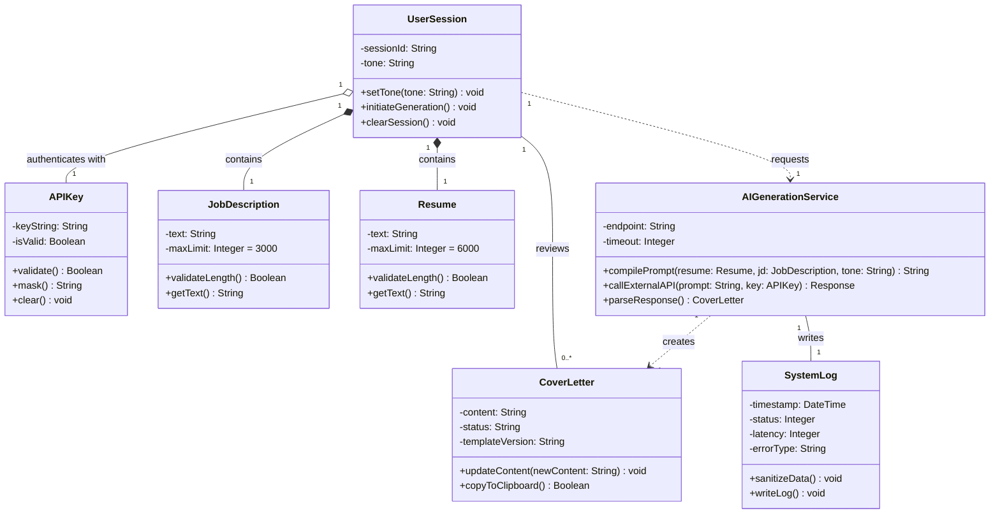

# Assignment 9: Domain Modeling and Class Diagram

## 1. Domain Model

The domain model defines the core conceptual entities of the TailorFit application. Since TailorFit uses a lightweight, stateless, Bring Your Own Key (BYOK) architecture, the model focuses on temporary session components and service interactions instead of persistent database tables.

### Core Domain Entities

| Entity | Attributes | Methods | Relationships |
|---|---|---|---|
| UserSession | `sessionId`, `tone` | `setTone()`, `clearSession()`, `initiateGeneration()` | Composes `JobDescription`, `Resume`; Aggregates `APIKey`; Requests `AIGenerationService`. |
| APIKey | `keyString`, `isValid` | `validate()`, `mask()`, `clear()` | Aggregated by `UserSession`. |
| JobDescription | `text`, `maxLimit` | `validateLength()`, `getText()` | Composed within `UserSession`. |
| Resume | `text`, `maxLimit` | `validateLength()`, `getText()` | Composed within `UserSession`. |
| CoverLetter | `content`, `status`, `templateVersion` | `updateContent()`, `copyToClipboard()` | Created by `AIGenerationService`; Reviewed by `UserSession`. |
| AIGenerationService | `endpoint`, `timeout` | `compilePrompt()`, `callExternalAPI()`, `parseResponse()` | Instantiated/Requested by `UserSession`; Creates `CoverLetter`; Writes `SystemLog`. |
| SystemLog | `timestamp`, `status`, `latency`, `errorType` | `writeLog()`, `sanitizeData()` | Written by `AIGenerationService`. |

### Business Rules

1. Authentication Rule: A generation request cannot be initiated unless a valid `APIKey` object exists and is validated within the current `UserSession` (FR-03).
2. Data Constraint 1: The `JobDescription` text attribute must not exceed its `maxLimit` of 3000 characters (FR-01).
3. Data Constraint 2: The `Resume` text attribute must not exceed its `maxLimit` of 6000 characters (FR-02).
4. Security Enforcement: The `SystemLog` object must explicitly execute its `sanitizeData()` method to strip out the `APIKey` string before persisting the log entry (NFR-09).

---

## 2. Class Diagram

### Mermaid.js Class Diagram

### Key Design Decisions

1. Composition vs. Aggregation (`*--` vs `o--`): 
   * I modeled the relationship between `UserSession` and both `Resume`/`JobDescription` using Composition. In the context of the single-page application architecture, these raw inputs exist *strictly* as part of the session lifecycle and are destroyed when the session clears.
   * I used Aggregation for the `APIKey`. While it is temporarily held in the session, the API key conceptually belongs to the user externally (as defined in the BYOK ADR), making its relationship inherently looser.
   
2. Stateless Nature of the Application: 
   * Unlike traditional enterprise software modeling that typically maps classes directly to relational database tables (e.g., `User` containing a persistent `id` and `password`), TailorFit is stateless. Therefore, the core orchestrator of the frontend is the `UserSession` object, simulating the ephemeral React/JS state.

3. Decoupling Generation from Logging: 
   * `SystemLog` is exclusively interacted with via the `AIGenerationService`, not the `UserSession`. This ensures that logging remains securely on the backend layer of the application, keeping sensitive data sanitization strictly out of the frontend classes.
